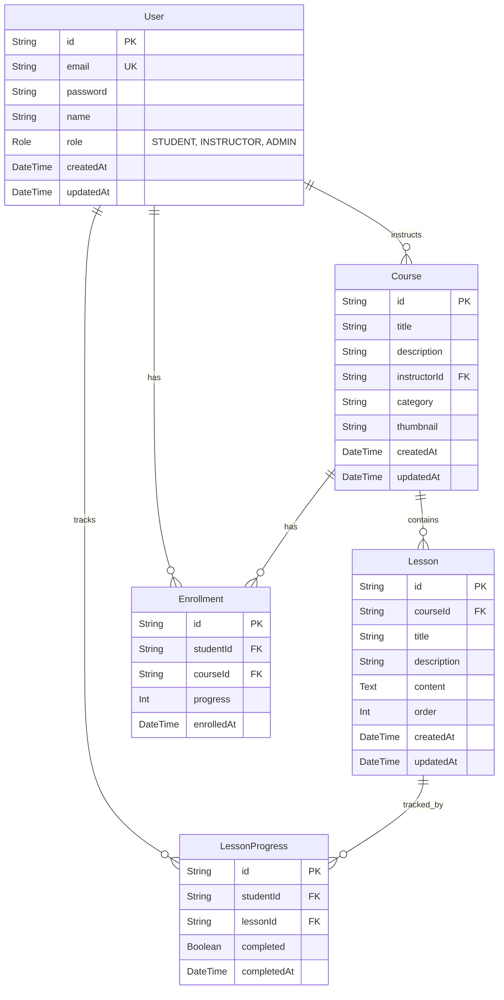

# Database Schema

The database for LearnFlow-MCP uses PostgreSQL, managed via Prisma ORM.

## ER Diagram

## Tables Overview

- **User**: Stores authentication details and roles.
- **Course**: Courses created by instructors.
- **Lesson**: Individual learning modules within a course.
- **Enrollment**: Tracks which student is taking which course and their overall progress.
- **LessonProgress**: Tracks the completion status of individual lessons for a student.
